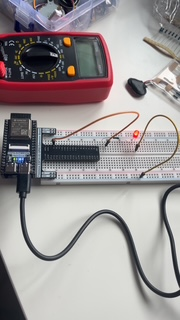
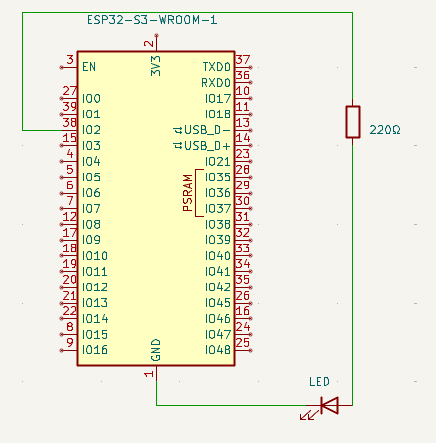

# ESP32 LED Blink

## Overview

A simple ESP32-S3 project that controls an external LED using GPIO 2.
The LED turns on for one second and off for one second repeatedly.

## Hardware

- ESP32-S3-WROOM-1 development board
- LED
- 220Ω resistor
- Breadboard
- Jumper wires

## Circuit

### Physical Circuit



### Schematic



## How It Works

GPIO 2 is configured as a digital output. The program sets GPIO 2
HIGH to turn the LED on, waits one second, then sets it LOW and waits
another second.

## Building and Flashing

From the project directory:

```bash
idf.py set-target esp32s3
idf.py build
idf.py flash
